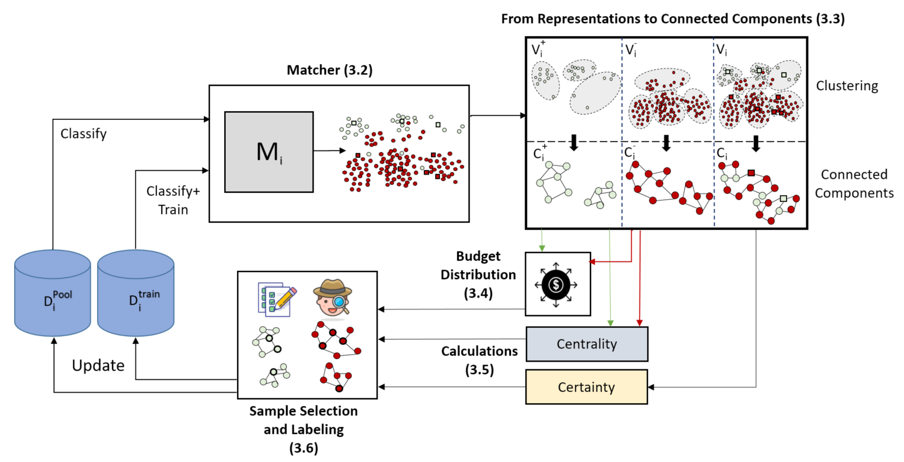

# The Battleship Approach
Code repository for our paper *The Battleship Approach to the Low Resource Entity Matching Problem* ([SIGMOD2023](https://2023.sigmod.org/)).

Entity Matching (ER) is the task of deciding whether two data tuples refer to the same real-world entity.
Solution based on pre-trained language models suffer from a major drawback as they require large amounts of labeled data for training.
To overcome the challenge of obtaining sufficient labeled data we offer a selection process, based on active learning, that uses domain adaptation to overcome the cold start problem and utilizes unique properties of entity matching.
We treat it as battleship game hunting indicative samples, focusing on positive ones, through awareness of the latent space along with careful planning of next sampling iterations.

In this work, we use [DITTO](https://github.com/megagonlabs/ditto) as a black box producing hidden representations for candidate pairs, as well as predicted labels and confidence values. 



## Requirements
1. The same as given in [DITTO](https://github.com/megagonlabs/ditto)
2. [PyTorch Geometric (Version 1.8.0)](https://pytorch-geometric.readthedocs.io/en/latest/#)
3. [Faiss](https://engineering.fb.com/2017/03/29/data-infrastructure/faiss-a-library-for-efficient-similarity-search/)

## Getting Started
We provide instructions for the sake of reproducibility.

### Datasets
The used datasets are provided in the [data](./data/) folder, divided to train, validation and test.

### Run
You can change the hyperparameters in main0.sh.
All source-target combinations appear in our paper can be found in comment lines.
Select the desired datasets combination, examined modes and additional hyperparameters such as batch size, number of epochs per active learning iteration and more.
Run the file using the following command:
```
bash main0.sh 100 10 3
```
where 100, 10 and 3 are the size of samples sent for labeling in a single active learning iteration, number of active learning iterations and number of examined seeds, respectively. You can change these parameters.
